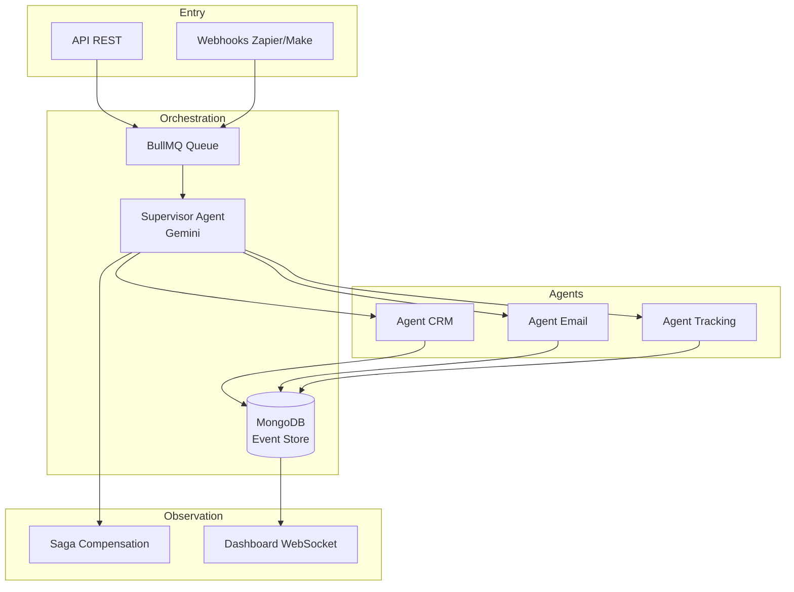

# MAS — Multi-Agent Orchestrateur de Workflows

Un agent **Plan-and-Execute (Goal-based hierarchical)** qui orchestre des workflows multi-étapes : webhook entrant → LLM planifie → BullMQ distribue → 3 agents spécialisés exécutent → Saga compense si échec → Dashboard temps réel.

**Formats d'intégration :** API REST, Webhooks (Zapier/Make), Dashboard temps réel WebSocket. Docker Compose up en 30s.

---

## Architecture



---

## How It Works

### 1. Entry — L'utilisateur soumet un goal

Via l'API REST ou un webhook :

```bash
curl -X POST http://localhost:3000/api/workflows \
  -H "Content-Type: application/json" \
  -d '{
    "goal": "Onboard brand partner Red Bull, contact alice@redbull.com, terms: 3 posts 15000€",
    "callback_url": "http://monapp.com/webhook/callback"
  }'
```

Ou via webhook (compatible Zapier/Make) :

```bash
curl -X POST http://localhost:3000/api/webhooks/onboard-partner \
  -H "Content-Type: application/json" \
  -d '{
    "brand": "Red Bull",
    "contact": "alice@redbull.com",
    "terms": "3 posts 15000€"
  }'
```

### 2. Planification — Le Supervisor décompose le goal

Le **Supervisor Agent** (Gemini 2.5 Flash) analyse le goal et produit un plan structuré :

```
Analyse: "Onboarding Red Bull nécessite : profil CRM, contrat, tracking, notification"

Steps:
  1. create_partner_profile → brand=Red Bull, contact=alice@redbull.com
  2. send_agreement → terms=3 posts 15000€, contact=alice@redbull.com
  3. setup_tracking → platforms=youtube,instagram
  4. notify_team → channel=slack
```

### 3. Exécution — BullMQ distribue aux agents spécialisés

Chaque étape est dispatchée dans la queue du sous-agent compétent :

```
▶ Step 1/4 — create_partner_profile → queue: create_partner_profile
  ✔ Succès (profil Red Bull créé: prof_1717000000)

▶ Step 2/4 — send_agreement → queue: send_agreement
  ✔ Succès (contrat envoyé à alice@redbull.com)

▶ Step 3/4 — setup_tracking → queue: setup_tracking
  ✔ Succès (tracking configuré youtube, instagram)

▶ Step 4/4 — notify_team → queue: notify_team
  ✔ Succès (notification Slack envoyée)
```

### 4. Saga Compensation — Si une étape échoue

Si une étape échoue, le Supervisor déclenche la Saga : les étapes réussies sont compensées en ordre inverse. Chaque outil définit sa propre méthode `compensate()`. Un callback POST est envoyé sur l'URL configurée avec le statut final (SUCCESS, COMPENSATED, FAILED).

### 5. Dashboard temps réel — WebSocket push

Le dashboard React reçoit chaque événement en temps réel via WebSocket (Redis Pub/Sub → broadcast). Timeline animée, toasts de notification, statuts en français.

---

## Stack

| Couche | Technologie | Usage |
|--------|-------------|-------|
| **Backend** | TypeScript + Express 5 | API REST, WebSocket, routes statiques |
| **Message queue** | BullMQ + Redis 7 | Queue de jobs, distribution aux agents |
| **Event store** | MongoDB 7 | Stockage append-only, replay événements |
| **Cache / Pub/Sub** | Redis 7 | Pub/Sub pour les événements temps réel |
| **Provider** | Google Gemini 2.5 Flash | Supervisor, planification LLM |
| **Dashboard** | React + TypeScript (modules) | Dashboard temps réel avec WebSocket |
| **Infrastructure** | Docker Compose | 6 services : API, Worker, 3 agents, MongoDB, Redis |
| **Orchestration** | BullMQ (Redis) | Queue worker, polling MongoDB, sagas |

---

## Quick Start

```bash
# Démarrer l'infrastructure (6 services)
docker compose up -d

# Lancer un workflow
curl -X POST http://localhost:3000/api/workflows \
  -H "Content-Type: application/json" \
  -d '{"goal":"Onboard Nike, contact nike@example.com, terms: 5 posts 50000€"}'

# Voir le workflow en temps réel → http://localhost:3000/
```

---

## Ce que ça prouve

### Compétences agentiques

| Compétence | Comment |
|------------|---------|
| **Plan-and-Execute hierarchical** | Supervisor LLM décompose le goal en étapes, dispatch aux sous-agents (Russell & Norvig — Goal-based hierarchical agent) |
| **Multi-agent orchestration** | 3 agents spécialisés (CRM, Email, Tracking) + Supervisor qui coordonne |
| **Message queue** | BullMQ/Redis : chaque étape est un job, chaque agent a sa queue dédiée |
| **Saga pattern** | Compensation en ordre inverse si une étape échoue — chaque outil a sa méthode compensate() |
| **Event sourcing** | MongoDB append-only : chaque événement est stocké, replayable |
| **CQRS** | Séparation : writes via BullMQ, reads via MongoDB + GET API |
| **WebSocket temps réel** | Redis Pub/Sub → broadcast WebSocket → dashboard React auto-rafraîchi |
| **Webhook pattern** | Entrée (POST /api/webhooks/:type) + sortie (callback POST sur URL configurée) |
| **BYOK** | GEMINI_API_KEY en variable d'environnement, pas dans le code |


